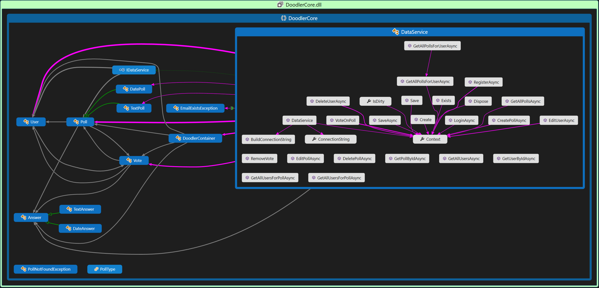

<p align="center">
  <h1 align="center">Doodler</h1>
  <p align="center">
    <a class="badge-align" href="https://www.codacy.com/app/mrousavy/Doodler?utm_source=github.com&amp;utm_medium=referral&amp;utm_content=mrousavy/Doodler&amp;utm_campaign=Badge_Grade"></a>
    <a href="https://ci.appveyor.com/project/mrousavy/doodler"></a>
    <a href="https://ci.appveyor.com/project/mrousavy/doodler"></a>
  </p>
  <blockquote align="center">
    <p>A date poll application</p>
  </blockquote>
</p>

For running and testing you will need to configure the database connection properties: Edit `%AppData%/Doodler/config.json`

## Build and Run
### Windows
1. `git clone https://github.com/mrousavy/Doodler/` 
2. Open the Project in Visual Studio
3. Build all (<kbd>Ctrl</kbd><kbd>Shift</kbd><kbd>B</kbd>)
4. Run/Debug the `Doodler` Project
5. For the DB Connection configure the `%AppData%\Doodler\config.json` config

### Linux
```sh
git clone https://github.com/mrousavy/Doodler/
cd Doodler/Doodler.CLI
dotnet restore
dotnet run # Any arguments to Doodler.CLI are passed here
```

## Unit Testing
> XUnit
```sh
git clone https://github.com/mrousavy/Doodler/
cd Doodler/DoodlerTests
dotnet restore
dotnet test
```

[Einteilung](https://docs.google.com/spreadsheets/d/1mnLEfydfwJCbYYD7tkKyigKelMGrNASt4ikNzSylRrY)


